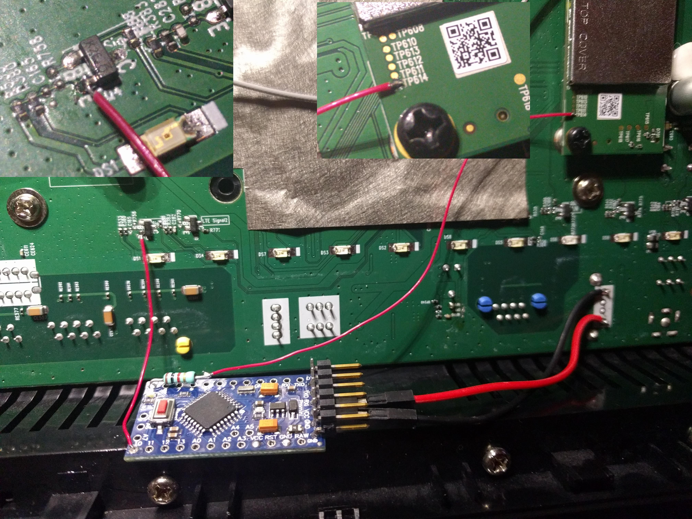

Instability issues in the router firmware did not seem to get fixed by the manufacturer. Problem was that the router lost it's LTE modem which was cured only by a hardware reset. By logging the device while modem hangup I noticed that the whole USB device was missing. UI was not able to read the IMEI. I opened the case and investigated the modem part. With some experience from this field I was able to guess the modem reset pin that was available as a test point. With the following Arduino pro mini setup I was able to get the router usable again.
System detects the modem hangup by the modem led and gives the modem a reset. Network drop hardly noticable. I have successfully used the setup for months.

 
---
